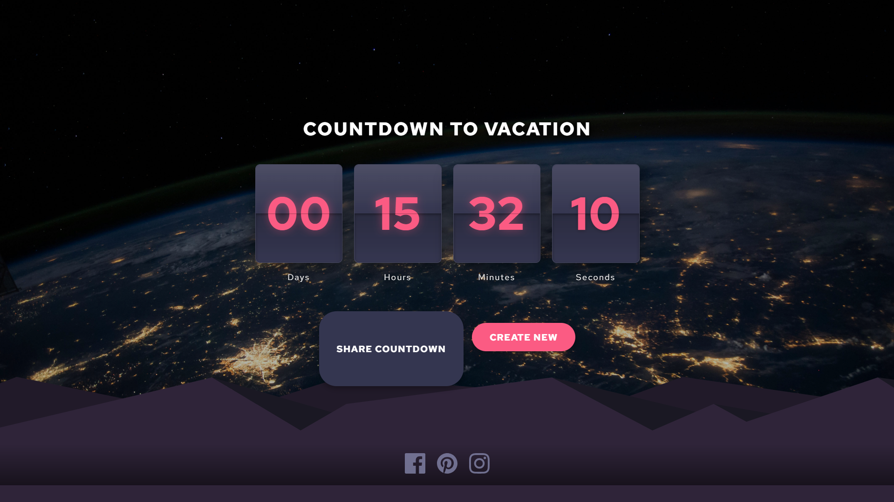

# Countdown Timer

I built this countdown timer using just HTML, CSS, and JavaScript - no frameworks or libraries. You can create countdowns for any event, pick different backgrounds, and share them with friends.

**Live Demo:** [Check out the live site](https://event-countdowntimer.netlify.app/)

## Screenshots



*The flip animation countdown timer with a space theme*

## What it does

This thing lets you:
- Make countdowns for whatever you want
- Pick from some cool background themes
- Share your countdowns with friends
- Save multiple countdowns without needing an account
- Works on phones, tablets, and computers
- Has a neat flip animation for the numbers

## Running it locally

The easiest way is to use the included server:

```
node server.js
```

Then just go to http://localhost:3000 in your browser.

If you don't have Node, you can use any web server like Python's `python -m http.server 8000` or just open the files directly in your browser (though sharing might not work right).

## Background images

I've included some placeholder backgrounds, but you might want to add your own. Just drop them in the assets/backgrounds folder and make small thumbnail versions with the same name plus "-thumb" at the end.

Some good places for backgrounds:
- Unsplash.com
- Pexels.com
- Your own photos

## How to use it

Pretty straightforward:
1. Type in your event name
2. Pick a date and time
3. Choose a background
4. Hit "Create Countdown"

You can share it with the share button, which gives you a link to send to people. All your countdowns show up on the home page where you can manage them.

## Under the hood

- Everything's saved in your browser's localStorage
- The sharing works by generating special URLs
- The flip animation is pure CSS
- It's responsive so it works on any screen size

## Stuff I might add later

- More background themes
- Custom colors
- Notifications when countdowns finish
- Recurring events
- Import/export for countdowns

## Credits

I grabbed some icons from Frontend Mentor and fonts from Google Fonts.

## Use It!

Feel free to use this code however you want - it's a personal project I built for fun and to practice my skills.
